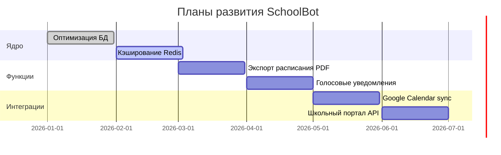

<div align="center">

# 🏫 SchoolBot — Умный помощник для школы

**Telegram-бот, который делает школьную жизнь проще**

[](https://python.org)
[](https://core.telegram.org/bots)
[](https://postgresql.org)
[](LICENSE)

[](https://github.com/Ygud2962/telegram-bot/stargazers)
[](https://github.com/Ygud2962/telegram-bot/network/members)

</div>

---

## 📖 О проекте

**SchoolBot** — это современный Telegram-бот, созданный для автоматизации школьной жизни.  
Мгновенные уведомления о заменах, удобное расписание, персональные настройки и школьные новости — всё в одном месте.

<div align="center">
  
  <br>
  <i>⚡ Всё за 2-3 клика!</i>
</div>

---

## ✨ Ключевые возможности

| Для учеников и родителей | Для учителей | Для администраторов |
|---------------------------|---------------|----------------------|
| 🔁 **Замены** – мгновенные уведомления об изменениях | 📋 **Личное расписание** | ➕ **Добавление замен** в 2 клика |
| 📅 **Расписание** для 5–11 классов | 🔔 **Уведомления** о назначенных заменах | 📝 **Публикация новостей** |
| ⭐ **Избранное** – быстрый доступ к частым запросам | ⚡ **Быстрый доступ** через избранное | 🔧 **Технический режим** с уведомлением |
| 🔍 **Поиск учителя** по фамилии | | 📊 **Статистика и аналитика** |
| 📰 **Школьные новости** | | 👥 **Мониторинг аудитории** |
| 🔔 **Расписание звонков и питания** | | |

---

## 🚀 Быстрый старт

<details open>
<summary><b>📦 Установка за 5 шагов</b></summary>

```bash
# 1️⃣ Клонируем репозиторий
git clone https://github.com/Ygud2962/telegram-bot.git
cd telegram-bot

# 2️⃣ Устанавливаем зависимости
pip install -r requirements.txt

# 3️⃣ Настраиваем переменные окружения
cp .env.example .env
# Отредактируйте .env, добавив BOT_TOKEN и другие параметры

# 4️⃣ Инициализируем базу данных
python database.py

# 5️⃣ Запускаем бота
python bot.py

🗄 Архитектура базы данных
file:///C:/Users/%D0%AE%D0%BB%D0%B8%D1%8F/OneDrive/Desktop/%D0%91%D0%BE%D1%82/deepseek_mermaid_20260218_32bfa4.svg

# Используем systemd для автозапуска
sudo nano /etc/systemd/system/schoolbot.service
[Unit]
Description=SchoolBot Telegram Bot
After=network.target

[Service]
Type=simple
User=www-data
WorkingDirectory=/opt/schoolbot
ExecStart=/opt/schoolbot/venv/bin/python bot.py
Restart=always
RestartSec=10

[Install]
WantedBy=multi-user.target


## 📱 Команды бота

### 👤 Пользовательские
| Команда | Описание |
|---------|----------|
| `/start` | 🏠 Главное меню |
| `/teachers` | 👥 Список учителей |
| ⭐ **МОё** | Избранное (кнопка в меню) |

### 🔐 Административные (только для `ADMIN_ID`)
| Команда | Описание |
|---------|----------|
| `/test` | 🧪 Тестовое уведомление |
| `/add_sub` | ➕ Добавить замену (интерактивно) |
| `/add_news` | 📰 Опубликовать новость |
| `/maintenance on/off` | 🔧 Вкл/выкл техрежим |
| `/stats` | 📊 Статистика бота |

---

## 🛠 Технологический стек

<div align="center">
  
[](https://python.org)
[](https://github.com/python-telegram-bot/python-telegram-bot)
[](https://www.psycopg.org/)
[](https://pythonhosted.org/pytz/)
[](https://docs.aiohttp.org/)

</div>

---

## 🗺 Дорожная карта



---

## 🤝 Как помочь проекту

- ⭐ **Поставьте звезду** — это лучшая поддержка!
- 🐛 **Сообщите об ошибке** в [Issues](https://github.com/Ygud2962/telegram-bot/issues)
- 💡 **Предложите идею** в [Discussions](https://github.com/Ygud2962/telegram-bot/discussions)

---

## 📄 Лицензия

<div align="center">
  
  <br>
  <strong>MIT License</strong> © 2026 Ygud2962
  <br>
  <sub>Сделано с ❤️ для школьного сообщества</sub>
  <br>
  <sub>🇧🇾 Europe/Minsk (UTC+3) • Февраль 2026</sub>
</div>
