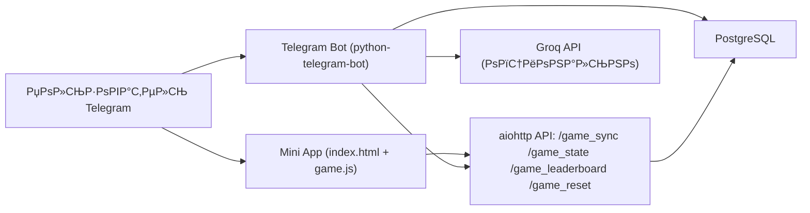

<div align="center">

# рџЏ« School Telegram Bot + Mini App
### 🔐 «Шифровальщик» · 1941–1945

Школьная экосистема в Telegram: **расписание, замены, новости, AI-помощник и образовательная игра**.

[](https://t.me/school_hoiniki_sch3_bot)
[](https://www.python.org/)
[](https://www.postgresql.org/)
[](https://railway.app/)
[](https://groq.com/)

<!-- AUTOVERSION:START -->
[](https://github.com/ygud2962/telegram-bot)
[](https://ygud2962.github.io/telegram-bot/)

| Компонент | Версия |
|---|---|
| 🤖 Bot | **9.8.0** |
| 🎮 Game | **1.7.78** |
<!-- AUTOVERSION:END -->

</div>

---

## ⚡ Быстрая навигация

| Раздел | Что внутри |
|---|---|
| [Возможности](#-возможности) | Что умеет бот и игра |
| [Архитектура](#-архитектура) | Как устроен проект |
| [Быстрый старт](#-быстрый-старт) | Запуск локально |
| [Переменные окружения](#-переменные-окружения) | Все env для Railway |
| [Railway setup](#-настройка-railway) | Пошаговая настройка |
| [API Mini App](#-api-mini-app) | `/game_sync`, `/game_state` Рё С‚.Рґ. |
| [Troubleshooting](#-частые-проблемы) | Что делать при сбоях |

---

## ✨ Возможности

### 🤖 Бот
- 📚 Расписание по классам и учителям.
- 🔄 Замены (вручную + AI-распознавание с фото).
- 📰 Новости с разделением:
  - `🏫 Новости школы`
  - `🤖 Новости бота`
- 🛠 Админ-панель: пользователи, режимы игры, роли, рассылки, техрежим.
- 🤖 AI-помощник через Groq (`GROQ_API_KEY`).

### 🎮 Игра «Шифровальщик»
- 🗺 6 глав, 36 заданий, 6 типов шифров.
- 🏆 Рейтинг, достижения, артефакты.
- 💾 Автосохранение прогресса в БД.
- ⏯ Продолжение главы после выхода из Mini App.
- ⚖ Штрафы/правила перезапуска главы.
- 🔊 Аудио-система:
  - 5 CC0-треков;
  - вкл/выкл музыки и эффектов;
  - отдельная громкость музыки и SFX.
- 🚨 Кнопка «Сообщить об ошибке» с быстрым переходом к администратору.

### 🕵 Реферальная система «Агенты»
- Личная ссылка: `https://t.me/<bot_username>?start=ref_<user_id>`.
- Бонусы:
  - новичку: `+1%` от его собственного заработка;
  - пригласившему: `N%` от заработка каждого агента, где `N = число приглашенных` (`1 агент = 1%`, `2 = 2%`, и т.д.).
  - начисление происходит автоматически и сразу при синхронизации прогресса (`/game_sync`).
- В профиле игры отображаются:
  - агрегированная статистика;
  - список агентов и их вклад.
- Дополнительные достижения за рефералов.

---

## 🧭 Архитектура


```mermaid
flowchart LR
  U["Пользователь Telegram"] --> B["Telegram Bot (python-telegram-bot)"]
  U --> W["Mini App (index.html + game.js)"]
  B --> D["PostgreSQL"]
  W --> A["aiohttp API: /game_sync /game_state /game_leaderboard /game_reset"]
  A --> D
  B --> A
  B --> G["Groq API (опционально)"]
```

### Ключевая логика доступа

| Уровень | Где хранится | Значения |
|---|---|---|
| Права админки бота | `bot_admins` | bot admin / user |
| Игровая роль | `game_roles` | `admin`, `tester`, `player` |
| Режим игры | `game_settings` | `closed`, `beta`, `open` |

`bot_admin` и `game admin` — **разные сущности**.

---

## 🚀 Быстрый старт

```bash
git clone https://github.com/ygud2962/telegram-bot.git
cd telegram-bot
python -m venv venv
venv\Scripts\activate
pip install -r requirements.txt
python bot.py
```

---

## ⚙️ Переменные окружения

### Обязательные

| Переменная | Описание |
|---|---|
| `BOT_TOKEN` | токен Telegram-бота |
| `DATABASE_URL` | строка подключения PostgreSQL |
| `GAME_URL` | публичный URL игры (обычно `https://<domain>/game/`) |
| `BOT_PUBLIC_URL` | публичный URL backend (`https://<domain>`) |

### Рекомендуемые/опциональные

| Переменная | По умолчанию | Описание |
|---|---|---|
| `PORT` | `8080` | порт HTTP-сервера |
| `BOT_VERSION` | `9.8.0` | версия бота (по умолчанию `9.8.0`) |
| `GAME_VERSION` | `1.7.78` | версия игры (по умолчанию `1.7.78`) |
| `GAME_BETA` | `0` | legacy-флаг беты |
| `GAME_AUTH_REQUIRED` | `1` | валидация Telegram `init_data` |
| `GAME_AUTH_TTL_SEC` | `86400` | срок жизни `init_data` (сек) |
| `GROQ_API_KEY` | пусто | ключ AI-помощника |
| `DB_STARTUP_MAX_WAIT_SEC` | `180` | максимум ожидания БД при старте |
| `DB_STARTUP_RETRY_SEC` | `5` | интервал повторных попыток БД |
| `SLOW_DB_MS` | `350` | порог логов slow DB |
| `SLOW_CALLBACK_MS` | `1000` | порог логов slow callback |

Также поддерживаются fallback-переменные Railway: `RAILWAY_PUBLIC_DOMAIN`, `RAILWAY_STATIC_URL`.

---

## 🧩 Настройка Railway

1. Подключить PostgreSQL к сервису.
2. В Variables задать:
   - `BOT_TOKEN`
   - `DATABASE_URL`
   - `BOT_PUBLIC_URL=https://<your-service>.up.railway.app`
   - `GAME_URL=https://<your-service>.up.railway.app/game/`
   - `GAME_VERSION=<текущая версия>`
3. После изменений фронта увеличивать `GAME_VERSION`.
4. Открывать игру из кнопки бота (не из старой вкладки WebView).

---

## ♻️ Сброс прогресса

В админке доступны 2 режима:
- `Только очки/главы` — реферальные связи сохраняются.
- `С агентами` — реферальные связи удаляются.

Применяется для:
- сброса конкретного игрока;
- массового сброса;
- self-reset Сѓ `game admin`.

---

## рџ”Њ API Mini App

| Endpoint | Метод | Назначение |
|---|---|---|
| `/game_sync` | `POST` | синхронизация прогресса из клиента |
| `/game_state?user_id=...` | `GET` | актуальное состояние игрока |
| `/game_leaderboard?user_id=...` | `GET` | рейтинг |
| `/game_reset` | `POST` | self-reset (только `game admin`) |
| `/health` | `GET` | healthcheck |

Если `GAME_AUTH_REQUIRED=1`, API проверяет подпись Telegram `init_data`.

---

## 🧪 Проверки перед деплоем

```bash
python -m py_compile bot.py database.py game_security.py
python -m unittest tests.test_game_security
python scripts/update_readme_versions.py
```

---

## 🧯 Частые проблемы

### 1) `Game failed to load`
- Проверить `GAME_URL` и `BOT_PUBLIC_URL`.
- Увеличить `GAME_VERSION`.
- Переоткрыть игру из кнопки в боте.

### 2) `409 Conflict getUpdates`
Во время overlap-редеплоя кратковременный `409` допустим. В проекте есть lock и фильтрация шумных логов.

### 3) Прогресс в боте и игре расходится
- Проверить актуальный `GAME_VERSION`.
- Проверить доступность backend по `BOT_PUBLIC_URL`.
- Проверить ответы `/game_state` и `/game_sync`.

---

## 🗂 Структура проекта

```text
telegram-bot/
в”њв”Ђ bot.py
в”њв”Ђ database.py
в”њв”Ђ game_security.py
в”њв”Ђ ui_texts.py
в”њв”Ђ game/
в”‚  в”њв”Ђ index.html
в”‚  в”њв”Ђ game.js
в”‚  в””в”Ђ security_patch.js
в”њв”Ђ scripts/
в”‚  в”њв”Ђ deploy-vscode.ps1
в”‚  в”њв”Ђ update_readme_versions.py
в”‚  в””в”Ђ update_latest_bot_news.py
в”њв”Ђ tests/
в”‚  в””в”Ђ test_game_security.py
в”њв”Ђ deploy.bat
в””в”Ђ README.md
```

---

## 🛠 Полезные скрипты

- `deploy.bat` — деплой в `main` с автообновлением версий README.
- `scripts/update_readme_versions.py` — обновление блока версий.
- `scripts/update_latest_bot_news.py` — вспомогательное обновление техновостей.

---

## 📮 Контакты

- Бот: [@school_hoiniki_sch3_bot](https://t.me/school_hoiniki_sch3_bot)
- РђРґРјРёРЅ: [@Yury_hud](https://t.me/Yury_hud)


