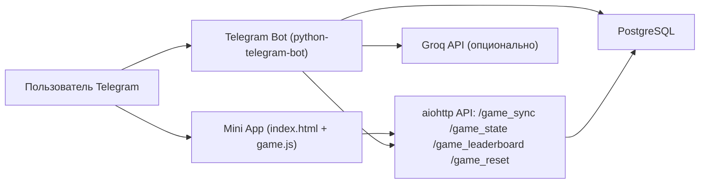

<div align="center">

# 🏫 School Telegram Bot + Mini App
### 🔐 «Шифровальщик» · 1941–1945

Школьная экосистема в Telegram: **расписание, замены, новости, AI-помощник и образовательная игра**.

[](https://t.me/school_hoiniki_sch3_bot)
[](https://www.python.org/)
[](https://www.postgresql.org/)
[](https://www.docker.com/)
[](https://groq.com/)

<!-- AUTOVERSION:START -->
[](https://github.com/ygud2962/telegram-bot)
[](https://ygud2962.github.io/telegram-bot/)

| Компонент | Версия |
|---|---|
| 🤖 Bot | **9.8.0** |
| 🎮 Game | **1.7.78** |
<!-- AUTOVERSION:END -->

</div>

---

## ⚡ Быстрая навигация

| Раздел | Что внутри |
|---|---|
| [Возможности](#-возможности) | Что умеет бот и игра |
| [Архитектура](#-архитектура) | Как устроен проект |
| [Быстрый старт](#-быстрый-старт) | Запуск локально |
| [Переменные окружения](#-переменные-окружения) | Все env для запуска |
| [VPS / Docker](#-запуск-на-vps-с-docker) | Деплой вместо Railway |
| [Переезд с Railway](#-переезд-с-railway-без-потери-данных) | Перенос PostgreSQL |
| [API Mini App](#-api-mini-app) | `/game_sync`, `/game_state` и т.д. |
| [Troubleshooting](#-частые-проблемы) | Что делать при сбоях |

---

## ✨ Возможности

### 🤖 Бот
- 📚 Расписание по классам и учителям.
- 🔄 Замены (вручную + AI-распознавание с фото).
- 📰 Новости с разделением:
  - `🏫 Новости школы`
  - `🤖 Новости бота`
- 🛠 Админ-панель: пользователи, режимы игры, роли, рассылки, техрежим.
- 🤖 AI-помощник через Groq (`GROQ_API_KEY`).

### 🎮 гра «Шифровальщик»
- 🗺 6 глав, 36 заданий, 6 типов шифров.
- 🏆 Рейтинг, достижения, артефакты.
- 💾 Автосохранение прогресса в БД.
- ⏯ Продолжение главы после выхода из Mini App.
- ⚖ Штрафы/правила перезапуска главы.
- 🔊 Аудио-система:
  - 5 CC0-треков;
  - вкл/выкл музыки и эффектов;
  - отдельная громкость музыки и SFX.
- 🚨 Кнопка «Сообщить об ошибке» с быстрым переходом к администратору.

### 🕵 Реферальная система «Агенты»
- Личная ссылка: `https://t.me/<bot_username>?start=ref_<user_id>`.
- Бонусы:
  - новичку: `+1%` от его собственного заработка;
  - пригласившему: `N%` от заработка каждого агента, где `N = число приглашенных` (`1 агент = 1%`, `2 = 2%`, и т.д.).
  - начисление происходит автоматически и сразу при синхронизации прогресса (`/game_sync`).
- В профиле игры отображаются:
  - агрегированная статистика;
  - список агентов и их вклад.
- Дополнительные достижения за рефералов.

---

## 🧭 Архитектура


```mermaid
flowchart LR
  U["Пользователь Telegram"] --> B["Telegram Bot (python-telegram-bot)"]
  U --> W["Mini App (index.html + game.js)"]
  B --> D["PostgreSQL"]
  W --> A["aiohttp API: /game_sync /game_state /game_leaderboard /game_reset"]
  A --> D
  B --> A
  B --> G["Groq API (опционально)"]
```

### Ключевая логика доступа

| Уровень | Где хранится | Значения |
|---|---|---|
| Права админки бота | `bot_admins` | bot admin / user |
| гровая роль | `game_roles` | `admin`, `tester`, `player` |
| Режим игры | `game_settings` | `closed`, `beta`, `open` |

`bot_admin` и `game admin` — **разные сущности**.

---

## 🚀 Быстрый старт

```bash
git clone https://github.com/ygud2962/telegram-bot.git
cd telegram-bot
python -m venv venv
venv\Scripts\activate
pip install -r requirements.txt
python bot.py
```

---

## ⚙️ Переменные окружения

### Обязательные

| Переменная | Описание |
|---|---|
| `BOT_TOKEN` | токен Telegram-бота |
| `DATABASE_URL` | строка подключения PostgreSQL |
| `DB_SSLMODE` | `require` для внешней БД, `disable` для PostgreSQL в Docker |
| `GAME_URL` | публичный URL игры (обычно `https://<domain>/game/`) |
| `BOT_PUBLIC_URL` | публичный URL backend (`https://<domain>`) |

### Рекомендуемые/опциональные

| Переменная | По умолчанию | Описание |
|---|---|---|
| `PORT` | `8080` | порт HTTP-сервера |
| `BOT_VERSION` | `9.8.0` | версия бота (по умолчанию `9.8.0`) |
| `GAME_VERSION` | `1.7.78` | версия игры (по умолчанию `1.7.78`) |
| `GAME_BETA` | `0` | legacy-флаг беты |
| `GAME_AUTH_REQUIRED` | `1` | валидация Telegram `init_data` |
| `GAME_AUTH_TTL_SEC` | `86400` | срок жизни `init_data` (сек) |
| `GROQ_API_KEY` | пусто | ключ AI-помощника |
| `DB_STARTUP_MAX_WAIT_SEC` | `180` | максимум ожидания БД при старте |
| `DB_STARTUP_RETRY_SEC` | `5` | интервал повторных попыток БД |
| `SLOW_DB_MS` | `350` | порог логов slow DB |
| `SLOW_CALLBACK_MS` | `1000` | порог логов slow callback |

Также поддерживаются legacy fallback-переменные Railway: `RAILWAY_PUBLIC_DOMAIN`, `RAILWAY_STATIC_URL`.

---

## 🖥 Запуск на VPS с Docker

Проект можно запускать на обычном VPS (например, CloudServer ActiveCloud) без Railway. В `compose.yaml` уже описаны три изолированных контейнера:

```text
Internet → Caddy (HTTPS) → bot + Mini App → PostgreSQL
                                      └── ежедневные дампы → отдельное хранилище
```

- PostgreSQL не имеет открытого порта в интернет: к нему может обращаться только бот и администратор через `docker compose exec`.
- Caddy сам выпускает и продлевает HTTPS-сертификат. Telegram Mini App требует публичный HTTPS-адрес.
- Данные БД хранятся в Docker volume и переживают перезапуск или обновление контейнеров. Volume **не является резервной копией**.

### 1. Подготовить VPS и домен

Нужны Ubuntu 24.04+, публичный IPv4 и домен, например `bot.example.by`. До запуска добавьте в DNS `A`-запись домена на IP VPS. Откройте только SSH, HTTP и HTTPS:

```bash
sudo apt-get update
sudo apt-get install -y docker.io docker-compose-v2 git
sudo systemctl enable --now docker
sudo usermod -aG docker "$USER"
sudo ufw allow OpenSSH
sudo ufw allow 80/tcp
sudo ufw allow 443/tcp
sudo ufw enable
```

После этого выйдите из SSH и подключитесь снова, чтобы вступила в силу группа `docker`; проверьте командой `docker compose version`. Если у провайдера есть отдельный облачный firewall, откройте в нём также TCP 80 и 443.

### 2. Настроить и запустить

```bash
sudo git clone https://github.com/ygud2962/telegram-bot.git /opt/school-bot
sudo chown -R "$USER":"$USER" /opt/school-bot
cd /opt/school-bot
cp .env.example .env
chmod 600 .env
nano .env
docker compose up -d --build
docker compose logs -f bot
```

В `.env` обязательно замените `BOT_TOKEN`, `DOMAIN`, `GAME_URL`, `BOT_PUBLIC_URL` и пароль PostgreSQL. Для Docker-варианта используйте один длинный пароль только из букв, цифр, `_` и `-`: его можно безопасно указать и в `POSTGRES_PASSWORD`, и внутри `DATABASE_URL`. `DB_SSLMODE=disable` допустим только потому, что база закрыта внутри Docker-сети; для внешней базы оставляйте `require`.

После запуска проверьте `https://<DOMAIN>/health`: ответ должен быть `{"ok": true}`. Не публикуйте порт PostgreSQL `5432` и не добавляйте `.env` в Git.

### 3. Обновление бота

```bash
cd /opt/school-bot
git pull --ff-only
docker compose up -d --build
docker image prune -f
```

Перед изменением фронта увеличивайте `GAME_VERSION`, затем открывайте игру из кнопки бота, а не из старой вкладки Telegram WebView.

### 4. Ежедневные резервные копии

Скрипт [scripts/backup-postgres.sh](scripts/backup-postgres.sh) создаёт проверяемый логический дамп PostgreSQL, сохраняет последние 14 дней и умеет отправлять копию во внешнее хранилище через `rclone`.

```bash
cd /opt/school-bot
cp .backup.env.example .backup.env
chmod 600 .backup.env
nano .backup.env
chmod 700 scripts/backup-postgres.sh
scripts/backup-postgres.sh
crontab -e
```

Добавьте в `crontab` строку (будет запуск в 03:15 UTC):

```cron
15 3 * * * /opt/school-bot/scripts/backup-postgres.sh >> /var/log/school-bot-backup.log 2>&1
```

`BACKUP_RCLONE_TARGET` должен указывать на заранее настроенное отдельное хранилище или другой сервер. Локальный каталог VPS защищает от ошибочного обновления, но не от потери самого VPS. Хотя бы раз в месяц нужно разворачивать один дамп в тестовой БД и убеждаться, что он открывается.

---

## 🚚 Переезд с Railway без потери данных

1. На новом VPS подготовьте файлы и `.env` из шагов выше, но запустите сначала **только** пустую БД. Не запускайте бот до импорта: иначе он создаст пустые таблицы, которые помешают восстановлению.

```bash
cd /opt/school-bot
docker compose up -d db
docker compose ps
```

Продолжайте, когда у `db` будет статус `healthy`.
2. В Railway остановите работающий бот, чтобы во время финального дампа никто не записал новые данные.
3. На компьютере с PostgreSQL-клиентом сохраните текущую БД. Не вставляйте настоящий URL в историю команд: задайте его в переменной окружения или в защищённом терминале.

```bash
pg_dump "$RAILWAY_DATABASE_URL" --format=custom --no-owner --no-privileges --file railway.dump
```

4. Скопируйте `railway.dump` на VPS, например: `scp railway.dump <user>@<vps-ip>:/opt/school-bot/`.
5. На VPS импортируйте дамп в ещё пустую базу:

```bash
cd /opt/school-bot
docker compose cp railway.dump db:/tmp/railway.dump
docker compose exec db sh -c 'PGPASSWORD="$POSTGRES_PASSWORD" pg_restore -h 127.0.0.1 -U "$POSTGRES_USER" -d "$POSTGRES_DB" --no-owner --no-privileges /tmp/railway.dump'
docker compose up -d --build
docker compose logs --tail=100 bot
```

6. Проверьте `/health`, расписание, один аккаунт ученика и игровой прогресс. Только после этого смените `GAME_URL`/`BOT_PUBLIC_URL` на новый домен и окончательно отключайте Railway.

Исходная база Railway остаётся нетронутой до ручного удаления, поэтому при проблеме можно вернуться к ней.

---

## ♻️ Сброс прогресса

В админке доступны 2 режима:
- `Только очки/главы` — реферальные связи сохраняются.
- `С агентами` — реферальные связи удаляются.

Применяется для:
- сброса конкретного игрока;
- массового сброса;
- self-reset у `game admin`.

---

## 🔌 API Mini App

| Endpoint | Метод | Назначение |
|---|---|---|
| `/game_sync` | `POST` | синхронизация прогресса из клиента |
| `/game_state?user_id=...` | `GET` | актуальное состояние игрока |
| `/game_leaderboard?user_id=...` | `GET` | рейтинг |
| `/game_reset` | `POST` | self-reset (только `game admin`) |
| `/health` | `GET` | healthcheck |

Если `GAME_AUTH_REQUIRED=1`, API проверяет подпись Telegram `init_data`.

---

## 🧪 Проверки перед деплоем

```bash
python -m py_compile bot.py database.py game_security.py
python -m unittest tests.test_game_security
python scripts/update_readme_versions.py
```

---

## 🧯 Частые проблемы

### 1) `Game failed to load`
- Проверить `GAME_URL` и `BOT_PUBLIC_URL`.
- Увеличить `GAME_VERSION`.
- Переоткрыть игру из кнопки в боте.

### 2) `409 Conflict getUpdates`
Во время overlap-редеплоя кратковременный `409` допустим. В проекте есть lock и фильтрация шумных логов.

### 3) Прогресс в боте и игре расходится
- Проверить актуальный `GAME_VERSION`.
- Проверить доступность backend по `BOT_PUBLIC_URL`.
- Проверить ответы `/game_state` и `/game_sync`.

---

## 🗂 Структура проекта

```text
telegram-bot/
├─ bot.py
├─ database.py
├─ game_security.py
├─ ui_texts.py
├─ game/
│  ├─ index.html
│  ├─ game.js
│  └─ security_patch.js
├─ scripts/
│  ├─ deploy-vscode.ps1
│  ├─ update_readme_versions.py
│  └─ update_latest_bot_news.py
├─ tests/
│  └─ test_game_security.py
├─ deploy.bat
└─ README.md
```

---

## 🛠 Полезные скрипты

- `deploy.bat` — деплой в `main` с автообновлением версий README.
- `scripts/update_readme_versions.py` — обновление блока версий.
- `scripts/update_latest_bot_news.py` — вспомогательное обновление техновостей.

---

## 📮 Контакты

- Бот: [@school_hoiniki_sch3_bot](https://t.me/school_hoiniki_sch3_bot)
- Админ: [@Yury_hud](https://t.me/Yury_hud)


